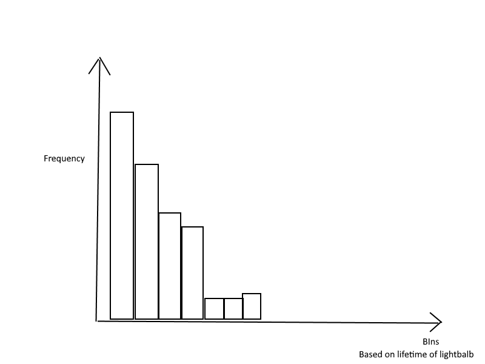

# Lab03 | Statistics Foundations

## Part 1
### Challange 1

*Find a and b, if median=42, mean=50 20,34, 34, 12, 56, 110, 49, a, b.*

Set of numbers = 20, 34, 34, 12, 56, 110, 49, a, b

Since median is 42 and this number is missing from the set it means that it has to be a or b. I assume that it is a.

  a = 42

Now based on the mean I can calculate b.

50 = (b + 20 + 34 + 34 + 12 + 56 + 110 + 49 + 42)/9

450 = b + 357

b = 93

Now, I check if everything is correct.

12, 20, 34, 34, **42**, 49, 56, 93, 110

a is a median and it is equal to 42.

mean = (12+20+34+34+42+49+56+93+110)/9= 450/9 = 50

b is thus equal to 93.

### Challange 2
*A car hit an average speed of v1 = 60 kmph in the first half of the journey, and hit an average speed of v2 = 110 kmph in the second half of the journey. Determine the average speed of the car.*

Since the two halfs are equal (i.e. first part od the journey = second part of the journey), the average speed can be simply calculated as an average of those two avreage speeds.

v_avg = (v1 + v2 )/2 = 60 + 110 / 2 = 170/2 = 85 kmph

### Challange 3
*The lifetimes of 400 light-bulbs were found to the nearest hour. The results were recorded as follows. Lifetime (hours) 0–199 200–399 400–599 600–799 800–999 1000–1199 1200–1999 Frequency 143 97 64 51 14 14 17 Construct a histogram and cumulative frequency polygon for this dataset. Estimate the percentage of bulbs with lifetime less than 480 hours.*

Cumulative frequency polygon is presnted in a Table below. I calulated it a sum of frequencies in a class and all preceeding classes.

| Lifetime (hours)     | 0-199 | 200-399 | 400-599 | 600-799 | 800-999 | 1000-1199 | 1200-1999 |
|----------------------|-------|---------|---------|---------|---------|-----------|-----------|
| Frequency            | 143   | 97      | 64      | 51      | 14      | 14        | 17        |
| Cumulative fequency  | 143   | 240     | 304     | 355     | 369     | 383       | 400       |

Histogram is presented in the first two rows. Lifetime(hours) can be treated as bins (x-axis) and frequency presented as bars (y-axis) will create a histogram.
The Histogram should look like something like the image below (created using paint.net, not to use Python)




The percentage of bulbs with lifetime less than 400h can be caluclate as a sum of frequency from the first two intervals divided by total cumlative frequency:

240/400 * 100% = 60% - Percentage of bulbs with lifetime less than 400h.

### Challange 4
*The time between arrival of 60 patients at an intensive care unit were recorded to the nearest hour. The data are shown below. Time (hours) 0–19 20–39 40–59 60–79 80–99 100–119 120–139 140–159 160–179 Frequency 16 13 17 4 4 3 1 1 1 Determine the median, mean and standard deviation for this dataset.*

Dataset:


| Time (h)  | 0-19 | 20-39 | 40-59 | 60-79 | 80-89 | 100-119 | 120-139 | 140-159 | 160-179 |
|-----------|------|-------|-------|-------|-------|---------|---------|---------|---------|
| Frequency | 16   | 13    | 17    | 4     | 4     | 3       | 1       | 1       | 1       |


#### Median:

In order to calculate median for grouped data I need to claulate cumulative frequency

| Time (h)             | 0-19 | 20-39 | 40-59 | 60-79 | 80-89 | 100-119 | 120-139 | 140-159 | 160-179 |
|----------------------|------|-------|-------|-------|-------|---------|---------|---------|---------|
| Frequency            | 16   | 13    | 17    | 4     | 4     | 3       | 1       | 1       | 1       |
| Cumulative frequency | 16   | 29    | 46    | 50    | 54    | 57      | 58      | 59      | 60      |

I will use the following formula:

Median = I + ((n/2 - c)/f) *h,

where:
- I - Lower limit of median class
- n - total number of class observations
- c - cumulative frequency of the preceeding class
- f - frequency of each class
- h - class size

In my case n = 60

60/2= 30

Cumulative frequency greater than 30 is 46, thus the median class is 40-59

Thus I = 40, f=17, c = 29, h = 19

**median = 40 + ((30-29)/17)\*19 = 40 + (19/17)= 41,12 so if it rounded to the whole number it is 41.**


#### Mean

To claculate mean I need to claculate midpoints for each class.

Midpoint can be calculated as a sum of lower and upper class limit divided by 2, thus

for class 0 -19 it is x1= 0+19/2= 19/2=9.5

Then I calculate for each class product of multipliaction fo markdown with frequency. Table below.


| Time (h)             | 0-19 | 20-39 | 40-59 | 60-79 | 80-89 | 100-119 | 120-139 | 140-159 | 160-179 | Total |
|----------------------|------|-------|-------|-------|-------|---------|---------|---------|---------|-------|
| Frequency            | 16   | 13    | 17    | 4     | 4     | 3       | 1       | 1       | 1       | 60    |
| Cumulative frequency | 16   | 29    | 46    | 50    | 54    | 57      | 58      | 59      | 60      | 429   |
| Class mark xi        | 9.5  | 29.5  | 49.5  | 69.5  | 84.5  | 109.5   | 129.5   | 149.5   | 169.5   | 800.5 |
| xi*fi                | 152  | 383.5 | 841.5 | 278   | 338   | 328.5   | 129.5   | 149.5   | 169.5   | 2770  |


Finally I can calculate mean as a sum of xi*fi divided by the sum of fi

**mean = 2770/60 = 46.1**

#### Standard deviation of grouped data

To claculate the standard deviation I nedd to first calculate the difrrence between midpoint and the mean to the power of 2. Then I need to multiply it by frequency and calculate the sum. All is done in the table below.


| Time (h)             | 0-19     | 20-39   | 40-59  | 60-79   | 80-89   | 100-119  | 120-139 | 140-159  | 160-179  | Total    |
|----------------------|----------|---------|--------|---------|---------|----------|---------|----------|----------|----------|
| Frequency            | 16       | 13      | 17     | 4       | 4       | 3        | 1       | 1        | 1        | 60       |
| Cumulative frequency | 16       | 29      | 46     | 50      | 54      | 57       | 58      | 59       | 60       | 429      |
| Class mark xi        | 9.5      | 29.5    | 49.5   | 69.5    | 84.5    | 109.5    | 129.5   | 149.5    | 169.5    | 800.5    |
| xi*fi                | 152      | 383.5   | 841.5  | 278     | 338     | 328.5    | 129.5   | 149.5    | 169.5    | 2770     |
| xi - mean            | -36.6    | -16.6   | 3.4    | 23.4    | 38.4    | 63.4     | 83.4    | 103.4    | 123.4    | 385.6    |
| (xi-mean)^2          | 1339.56  | 275.56  | 11.56  | 547.56  | 1474.56 | 4019.56  | 6955.56 | 10691.56 | 15227.56 | 40543.04 |
| f*(xi-mean)^2        | 21432.96 | 3582.28 | 196.52 | 2190.24 | 5898.24 | 12058.68 | 6955.56 | 10691.56 | 15227.56 | 78233.6  |

Now I can calculate the standard deviation by calculating square root of sum(f*(xi-mean)^2)/(n-1), which in my case is equal to 78233.6/(60-1)

**standard deviation = 1325.99322^0,5 = 36.41**


## Part 2

### Challange 1

*One player rolls two dices. Describe the measurable space and the random variable for:*

- **A. the values that the player obtains**
Measurable space will be the same for all three cases:
Omega = {
	(1,1),(1,2),(1,3),(1,4),(1,5),(1,6),
	(2,1),(2,2),(2,3),(2,4),(2,5),(2,6),
	(3,1),(3,2),(3,3),(3,4),(3,5),(3,6),
	(4,1),(4,2),(4,3),(4,4),(4,5),(4,6),
	(5,1),(5,2),(5,3),(5,4),(5,5),(5,6),
	(6,1),(6,2),(6,3),(6,4),(6,5),(6,6),
	}

random variable here will be equal to:

event1 - first dice: value from one to 6

event2 - second dice: value from one to 6

- **B. the sum of the values obtained**

Based on the Omega from A I can represnt it as a sum of two dices:

Omega = {
	2,3,4,5,6,7,
	3,4,5,6,7,8,
	4,5,6,7,8,9,
	5,6,7,8,9,10,
	6,7,8,9,10,11,
	7,8,9,10,11,12
	}

Random variable in this case will be equal to the unique values in omega thus:
x = {2,3,4,5,6,7,8,9,10,11,12}

- **C. The maximum value obtained after rolling both dices**

random variable x = {12}

measurable space will be the same as in case A.

- **Case A: Both values are greater than 5.**

From A. I see that there is 36 diffrent possibilities of result with 2 dices. There is only one case when both values are greater than 5. It is when two dices are equal to 6. Probability of Case A is thus equal to 1/36.

- **Case B: The sum of values is even.**

From B. and A I know that there is 36 possibilities and 18 of them give the even sum. This means that the probability of Case B is equal to 1/2.

- **Case C: The maximum is the value of both rolls**

It is the same as Case A, thus when two dices are equal to 6. The probability of such event is equal to 1/36.

### Challenge 2
*One player picks two cards from a poker deck. Describe the measurable space and the random variable for:*

- **A. The number of figures he picks.**
In a standard deck there are 52 cards of 4 colors(S-spades, H-hearts, D-diamonds,C-clubs). In each color there are 3 figures: jack (J), queen (Q) and king (K).

Measurable space Omega is equal to the all of possible combination of two cards
event1 - c1 out of 52 crad deck
event2 - c2 out of 52-c1 card deck

Omega = { (aceS, aceH), (aceS,aceD)...
		... (10H, 10D), (10D, 10C)}

random varibales in case of figures will be equal to event1 + event2 :

x = { (JS, JH), (JS,JD), (JS, JC), (JS, QS), (JS,QH), (JS, QD), (JS, QH,), (JS, KS), (JS,KD), (JS, KH), (JS,KD)... (KS,KH), (KS,KD),(KS,KD)}

- **B. The sum of card values. Consider that the value of figures is 10 and the value of aces is 15.**

Omega is the same as for cas A.

random variable will be equal to
x:

```
ace + 2 = 17
ace + 3 = 18
ace + 4 = 19
ace + 5 = 20
ace + 6 = 21
ace + 7 = 22
ace + 8 = 23
ace + 9 = 24
ace + 10 or K or Q or J = 25
ace + ace = 30 - highest combination
2 + 2 = 4 - smallest combination
2 + 3 = 5
2 + 4 = 6
...
...
```
The random variable may have values from 4 to 25  and 30

- **C. The number of hearts or spades he picks.**

Omega is the same as in previouys cases.
The random variable is equal to 0, 1 or 2, as the player can pick maximum two hearts or two spedes and as well he can pick zero of the cards from these colors.

**Describe the following events:**

- **Case A: The number of figures in the cards the player picked is two.**

The player will have to pick up figure in the first and in the second event. In the deck there are 12 figures (3 in each color) so the probability of that is equal to 12/52. In the second event player can choose from 51 cards, and assuming that in the first one he choose a figure there are only 11 left, so the probability of the second event is equal to 11/51.
Total probaility of case A is this 12/52 * 11/51.

- **Case B: The sum of card values is 17.**

The combinations that give the sum of 17 are:
- ace and 2
- 7 and 8
- 7 and 10
- 7 and K
- 7 and Q
- 7 and J


- **Case C: The value of both cards is less than 8.**

If the values of both cards would be less then 8 then the player in the both events (event1 and event2) would have to pick 2, 3, 4, 5, 6 or 7. So there are 6 cards in each color like that.
In the first event the probability of that is equal to 6*4/52 = 24/52
In the second event the probability of that is equal to 23/51 (as the player have already picked up one card that is less than 8).


### Challange 4
*Two players roll a dice. Describe the measurable space and the random variable for:*

- **A. The score of player A.**

There are two events:

event1 - player A rolls a dice

event2 - player B rolls a dice

Thus assuming that the first position is the score of player A and the second is the score of player B (A,B). The measurable space is equal to:

```
Omega = {
	(1,1),(1,2),(1,3),(1,4),(1,5),(1,6),
	(2,1),(2,2),(2,3),(2,4),(2,5),(2,6),
	(3,1),(3,2),(3,3),(3,4),(3,5),(3,6),
	(4,1),(4,2),(4,3),(4,4),(4,5),(4,6),
	(5,1),(5,2),(5,3),(5,4),(5,5),(5,6),
	(6,1),(6,2),(6,3),(6,4),(6,5),(6,6),
	}
```

The random variable of player A will be in range from 1 to 6.

- **B. The greatest score.**

Omega will be the same.

The greatest score will appear when one of the players rolls a number higher then the other one, so by looking at the omega we can see that there are 6 situation when this situation doesn't happen i.e. they both roll the same number.

- **C. The earnings of player A if the game rules state that: "The player with the greatest score gets a coin from the other player."**

Omega will be the same.

Random variable for player A will be equal to 0 or 1, as he may win the coin or not.

- **D. The earnings of player A if the game rules state that: "The player with the greatest score gets as many coins as the difference between the score of player A and player B."**

Omega will be the same.

The maximum diffrence is when Player A rolls 6 and player B rolls 1, so Player A can win maxiumum of 5 coins. Thus random variable for that event will be equal to 0, 1, 2, 3, 4 or 5.

#### Describe the following events:

- **Case A: The score of player A is 2.**

Player A rolls the dice one time, so the probability of that event is equal to 1/6.

- **Case B: The greatest score is lower or equal than 2.**

The greatest score cannot be lower than 2. Thus there are only two cases when this condition is fullfiled i.e. when one of the player rolls 2 and the other rolls 1.

- **Case C: Considering the case where the winner gets as many coins as the difference between scores (D), describe: Player A wins at least 4 coins. Player A loses more than 2 coins. Player A neither wins nor loses coins.**

- Player A wins at least 4 coins

In order for that event to happen the diffrence between score of player A and score of player B have to be equal or greater than 4. Thus when player A rolls 6 and player B rolls 1 or 2, second scenario is when Player A rolls 5 and player B rolls 1.

- Player A losses more than 2 coins.

In order for that event to happen the diffrence between score of player B and A have to be equal or greater than 2. This will happen in the following cases:
  - Player A rolls 1, and player B rolls 3 or higher
  - Player A rolls 2, and player B rolls 4 or higher
  - Player A rolls 3, and player B rolls 5 or higher
  - Player A rolls 4, and player B rolls 6.

- Player A neither wins nor losses coins.

This is a situation of a tie. There six options for that, when both players roll the same number.


## Bonus Challanges

### Bonus Challange 1
*Three players take balls from a box. Inside that box there are red, blue, green and black balls. The players can take three balls at mosts with the following rules:*

If the ball is blue, they can take another ball.
If the ball is green, they get one point and they can take another ball.
If the ball is red, they can’t take another ball.
If the ball is black, they lose one point and they can’t take another ball.
Describe the measurable space and the random variable for:
```
A. Player A wins. Do not consider ties as a win.
B. Player A and B get the same points.
C. All players get 0 points.
```
Measurable space so Omega will be equal to (B-Blue, G-Green, R-Red, Bl-Blacl) for 1 player:

```
omega= {(B), (B,G), (B,R), (B,Bl), (B,G,R), (B,G,Bl),
		(G), (G,B), (G,R), (G,Bl), (G,B,R), (G,B,Bl),
		(R),
		(Bl),
		}
```
All of this options for one player result in a scour -1, 0 or 1.

The total measurable space is a combination of three spaces like the one above one for each player.

The other way to look at it is the final score, then the possible output will be (assumming result of player A,B anc C as a tuple (A,B,C))
```
omega = {(-1,-1,-1), (-1,0,-1), (-1,1,-1), (-1,-1,0),(-1,-1,1)
		(0,-1,-1), (0,0,-1), (0,1,-1), (0,-1,0), (0,-1,1),
		(1,-1,-1), (1,0,-1),(1,1,-1),(1,-1,0),(1,-1,1),(0,0,0),(1,1,1)...}
```

- **Player A wins. Do not consider ties as a win.**

In order for player to win he needs to get a point (and other players have zero or minus points) so case when he takes green ball as first or as second and none of the balls is black (four options like that) or he can have zero points and
the other players have minus points, so the cases for that are: (R), (B,R), (G,Bl),(B,G,Bl).

- **B. Player A and B get the same points.**

In order for that event to happen they have to both have the same result so -1, 0 or 1.

- **C.All players get 0 points.**

In this situtation all the players have to take out:
- either red or blue and red
- or they take out first green and then black ball, between them blue ball may appear.

### Bonus Challange 2
*Consider the situation of bonus challenge 1 but now with four players. Does anything change in your solutions? What are the changes in each case?*
 The measurable space for each player is the same, but when we look at the measurable space of final results it is much bigger as it is a combination of 3 digits (-1, 0 , 1) which can form 4 element tuple with repetition.

 - **Casa A**

Here situation is similar. For player A to win he needs to get 1 or zero points when all of the other players have to get respectively 0 or -1 and -1 points. Probablity of this event decreases as there is an additional player.

 - **Casa B**

Here situatation is the same. They have to have the same score of -1, 0 or 1 while the score of other players is not of intrest

 - **Casa C**

In terms of what needs to happen it is the same, but since there is one more player the probability of that even is lower.

### Bonus Challange 3
*One player takes three balls from a box. Inside the box there are 5 balls: two of them are black and the other three are white.Describe the measurable space and the random variable for:*

**A. The number of white balls if every time we take a ball we keep it.**

Random variable can be white or black.
Measurable space is equal  at first 5 options 3 white and 2 black. After the first ball is out it decreses to 4 options. Then it becomes 3 options . After the last ball it becaomes 2 options. We don't know what the options exactly are as it depends from the color of the ball that was taken out.

**B. The number of white balls if every time we take a ball we put it back again into the box.**

Ranodm variable can be white or black, while measurable space stays the same and is always equal to 5 options 3 white and 2 black.

**C. The number of black balls if every time we take a ball we keep it.**

Random variable can be white or black.
Measurable space is equal  at first 5 options 3 white and 2 black. After the first ball is out it decreses to 4 options. Then it becomes 3 options . After the last ball it becaomes 2 options. We don't know what the options exactly are as it depends from the color of the ball that was taken out.
The change here (compared to case A) is that if the two first balls taken out were black, then we know that the next ball has to be white thus we no longer have random variable.

**D. The number of black balls if every time we take a ball we put it back into the box.**

Ranodm variable can be white or black, while measurable space stays the same and is always equal to 5 options 3 white and 2 black.

## Part3

### Challange 1

Below is my SQL code:
```SQL
CREATE DATABASE mod2_lab3;
USE mod2_lab3;

CREATE TABLE challange1 (student_id int, score int);

INSERT INTO mod2_lab3.challange1
VALUES
(1, 91),
(2,	72),
(3,	98),
(4,	62),
(5,	62),
(6,	95),
(7,	83),
(8,	86),
(9,	56),
(10, 97),
(11, 58),
(12, 71),
(13, 87),
(14, 83),
(15, 98);

-- SUM
SELECT sum(score) as Total_Score FROM challange1;

-- MEAN
SELECT ROUND(AVG(score),2) as Mean_Score FROM challange1;

-- MIN
SELECT min(score) as Min_Score FROM challange1;

-- MAX
SELECT max(score) as Max_Score FROM challange1;

-- STANDARD DEVIATION
SELECT ROUND(stddev(score),2) as STD_Score FROM challange1;

-- VARIANCE
SELECT ROUND(variance(score),2) as Variance_Score FROM challange1;
```

And here are the results:

- Mean:

| Mean_Score |
|------------|
| 79.93      |


- Sum:

| Total_Score |
|-------------|
| 1199        |


- Standard Deviation:

| STD_Score |
|-----------|
| 14.69     |


- Variance:

| Variance_Score |
|----------------|
| 215.93         |

- Minimum:

| Min_Score |
|-----------|
| 56        |


- Maximum:

| Max_Score |
|-----------|
| 98        |
