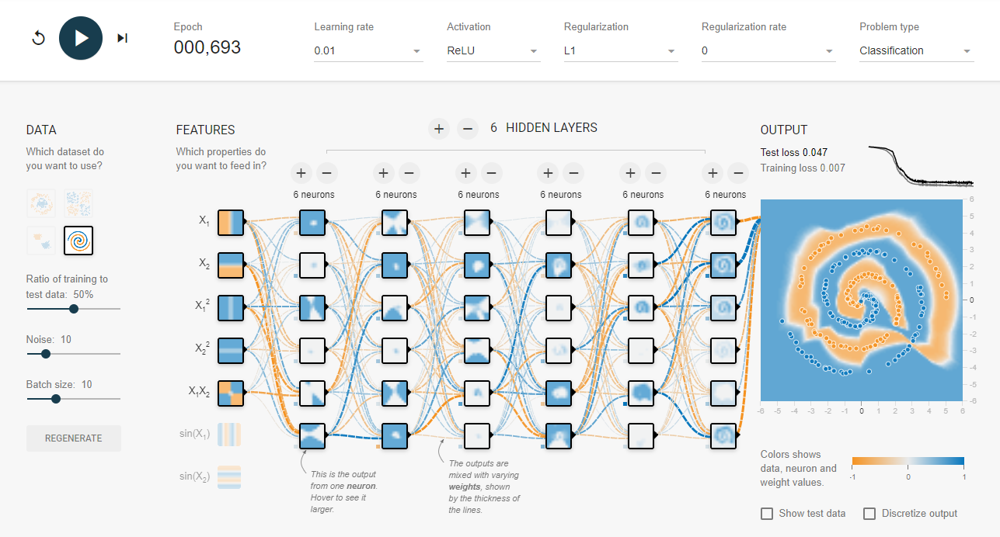

## Lab13 | Module_3 | Deap Learning 

Here are the solutions to the Lab13: Deep Learnirng

### Challenge 1:

Jupter notebook: challenge-1

### Challenge 2:

This is the result that I got from TensorFlow Playground:

### Challenge 3:

Jupter notebook: challenge-3

Folder: Results from hyperparameter tunning for 2 spirals problem
